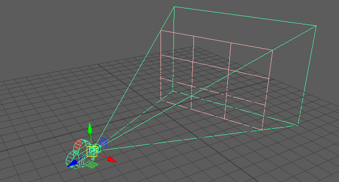
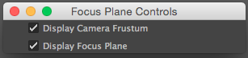

# focus-plane
a Maya tool created by Cameron Billingham

focus-plane is a python script written for Maya that creates a visualization frame of a camera frustum and the focus distance plane. It allows the user to see a physical representation of where the focus is and manually move that object to set the focus distance for the shot.

## Purpose of the Tool
The purpose of the tool is to provide a really simple way for a maya user to manipulate and see where the focus of a camera lies. Trying to gauge what objects are in focus for a maya camera based on the focus distance number is difficult. This tool would allow the user to easily see what is in focus and what isn't, as well as what is currently in the camera's field of view. You can see a rough idea in Figure 1 below.

## How to Use It
To use focus-plane, first copy the script from the focus-plane.py file and paste it into Maya's Python console. Now, I recommend dragging the highlighted code from the console to the custom tool shelf to create a custom button that applies the code for repeated use. 

To use the script on a camera just:

1. Select the camera you would like to apply the script to.
    * Currently only works on one camera at a time
3. Run the script
    * If it doesn't already exist, this populates the frustum and focus plane object under the camera
    * It will then bring up the GUI checkboxes for switching the views
4. Now you can switch the frustum and focus plane on/off
    * Moving the focus distance under the camera will move the plane

Additional Future Features (goal is to get these finished)

* I am working on the ability to move the focus plane back and forth to adjust the focus distance
* I would like to implement a button that allows you to snap the focus plane distance to that of a currently selected object. That way you could assure that the focus distance was on that object. 

## Assumptions
focus-plane tool assumes that you are running the latest version of Maya 2016. It also assumes you are using Maya's built in cameras.

## Technical Details
focus-plane uses camera information from the selected camera to mathematically calculate the current camera frustum and keep it update. It also uses this information in a formula to calculate the focus plane within the frustum.

